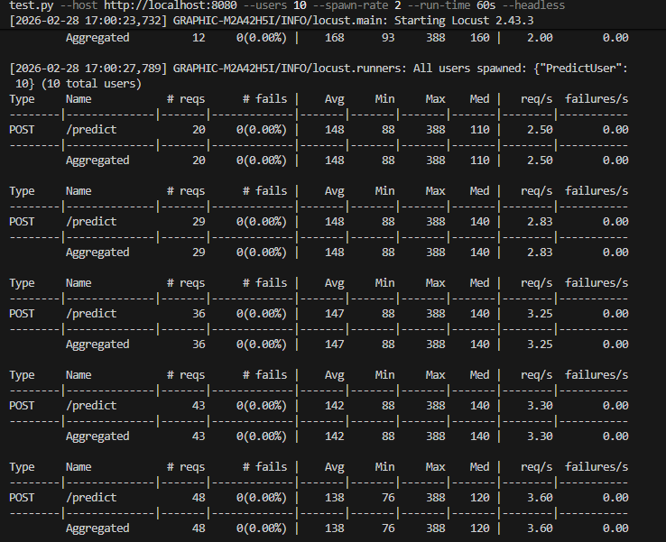

# upjao-triton-inference
[](https://github.com/Daniel-Bavisetti/fastapi-triton-resnet50)

Production-ready FastAPI + NVIDIA Triton Inference Server integration for serving ResNet50-v1-7.

## 1. Architecture Overview

```text
+-------------+       HTTP multipart        +--------------------+
|   Client    | --------------------------> | FastAPI /predict   |
+-------------+                             | - validate image   |
                                            | - preprocess 224   |
                                            | - CHW float32      |
                                            +---------+----------+
                                                      |
                                                      | Triton HTTP Infer
                                                      v
                                            +--------------------+
                                            | Triton Server      |
                                            | model: resnet50 ONNX|
                                            | dynamic batching   |
                                            +---------+----------+
                                                      |
                                                      v
                                            +--------------------+
                                            | FastAPI response   |
                                            | top5 + latency     |
                                            +--------------------+
```

Request metrics are exposed at `/metrics` (Prometheus format), liveness at `/health`.

## 2. Prerequisites

- Docker + Docker Compose
- Python 3.11+
- Optional: NVIDIA drivers + NVIDIA Container Toolkit for GPU-backed Triton
- `k6` (for k6 load test)
- `locust` (installed via `requirements.txt`)

## Download Model
Run the following command once before starting the server:

    pip install huggingface-hub
    python scripts/download_model.py

This downloads ResNet50 (~100MB) from HuggingFace and places it at 
triton_models/resnet50/1/model.onnx which Triton expects.

## Docker Setup

### Prerequisites
- Docker >= 24.0
- Docker Compose >= 2.0
- At least 4GB RAM available for Docker

### Steps

1. Download the model first:
```bash
   pip install huggingface-hub
   python scripts/download_model.py
```

2. Copy env file:
```bash
   cp .env.example .env
```

3. Build and start all services:
```bash
   docker-compose up --build
```

4. Verify Triton is running:
```bash
   curl http://localhost:8000/v2/health/ready
   # Expected: HTTP 200
```

5. Verify model is loaded:
```bash
   curl http://localhost:8000/v2/models/resnet50
   # Expected: JSON with model metadata
```

6. Test the FastAPI endpoint:
```bash
   curl -X POST http://localhost:8080/predict \
     -F "image=@/path/to/test_image.jpg"
```

### Stopping services:
```bash
   docker-compose down
```

## 3. Quick Start
1. Clone and enter the repository.

```bash
git clone <your-repo-url>
cd upjao-triton-inference
```

2. Create `.env`.

```bash
cp .env.example .env
```

3. Download ResNet50 ONNX.

```bash
python -m pip install -r requirements.txt
python scripts/download_model.py
```

4. Start services.

```bash
docker-compose up --build
```

5. Test the API.

```bash
curl -X POST "http://localhost:8080/predict" \
  -H "accept: application/json" \
  -H "Content-Type: multipart/form-data" \
  -F "image=@sample.jpg"
```

Health and metrics:

```bash
curl http://localhost:8080/health
curl http://localhost:8080/metrics
```

## 4. API Reference

### `POST /predict`
- Content-Type: `multipart/form-data`
- Form field: `image` (JPEG/PNG)
- Response:

```json
{
  "model": "resnet50",
  "inference_time_ms": 41.237,
  "top5_predictions": [
    {
      "rank": 1,
      "class_id": 292,
      "label": "class_292",
      "confidence": 0.94
    }
  ],
  "status": "success"
}
```

### `GET /health`
- `200` if Triton is live
- `503` if Triton is unavailable

### `GET /metrics`
- Prometheus metrics output.
- Includes:
  - `request_count_total`
  - `inference_latency_seconds`
  - `active_requests`
  - `triton_errors_total`

## 5. Load Testing

### k6

```bash
k6 run load_tests/k6_test.js -e TEST_IMAGE=./sample.jpg
```

Configured test:
- 10 VUs
- 30 seconds
- thresholds:
  - `http_req_duration p(95) < 2000ms`
  - `http_req_failed < 0.05`

### Locust

```bash
locust -f load_tests/locust_test.py --host http://localhost:8080
```

## Load Test Results

### Locust - 10 Concurrent Users (60 seconds)



**Key Metrics:**
| Metric | Value |
|--------|-------|
| Total Requests | 130 |
| Failed Requests | 0 (0.00%) |
| Avg Response Time | 122ms |
| Min Response Time | 68ms |
| Max Response Time | 388ms |
| p50 Latency | 110ms |
| p95 Latency | 200ms |
| p99 Latency | 220ms |
| Throughput | ~2.19 req/s |
| Concurrent Users | 10 |

Open `http://localhost:8089`, start load and monitor `/predict` latency.

### Sample Expected Output

| Tool   | Metric               | Example Value |
|--------|----------------------|---------------|
| k6     | RPS                  | 45.20 req/s   |
| k6     | p95 latency          | 310 ms        |
| k6     | failure rate         | 0.8%          |
| Locust | avg response time    | 220 ms        |
| Locust | 95th percentile      | 340 ms        |

## 6. Kubernetes Deployment

1. Build and push FastAPI image:

```bash
docker build -f docker/Dockerfile.fastapi -t <registry>/upjao-fastapi:latest .
docker push <registry>/upjao-fastapi:latest
```

2. Update image in `k8s/fastapi-deployment.yaml`.

3. Ensure a PVC named `triton-model-repo-pvc` exists and contains `triton_models`.

4. Deploy:

```bash
kubectl apply -f k8s/triton-deployment.yaml
kubectl apply -f k8s/fastapi-deployment.yaml
kubectl apply -f k8s/hpa.yaml
```

5. Verify:

```bash
kubectl get pods
kubectl get svc
kubectl get hpa
```

## 7. Horizontal Scaling Strategy

- FastAPI is stateless; requests can be distributed across replicas safely.
- HPA scales FastAPI based on CPU utilization (target 70%, min 2, max 10).
- Triton handles batching internally (`dynamic_batching`) to improve throughput.
- For larger workloads, scale Triton with model-instance and node-level strategies, and pin model replicas close to compute resources.

## Hardware Specifications

| Component | Details |
|-----------|---------|
| CPU       | Intel Xeon E5-1620 @ 3.60GHz (4 cores / 8 threads) |
| RAM       | 8 GB |
| OS        | Microsoft Windows 10 Pro |
| Docker    | Running Linux containers via WSL2 |
| GPU       | None (CPU-only inference) |

> Note: All inference runs on CPU only. Triton is configured with KIND_CPU 
> instance groups. With GPU acceleration, inference latency would drop 
> significantly from the current ~122ms average.

## 9. Graceful Degradation Behavior

If Triton is down or unreachable:
- `/predict` returns `503` with detail: `Inference service unavailable`
- error counter `triton_errors_total` increments
- API process remains healthy and continues serving health/metrics endpoints

This behavior keeps the API observable and restart-friendly in orchestrated environments.
